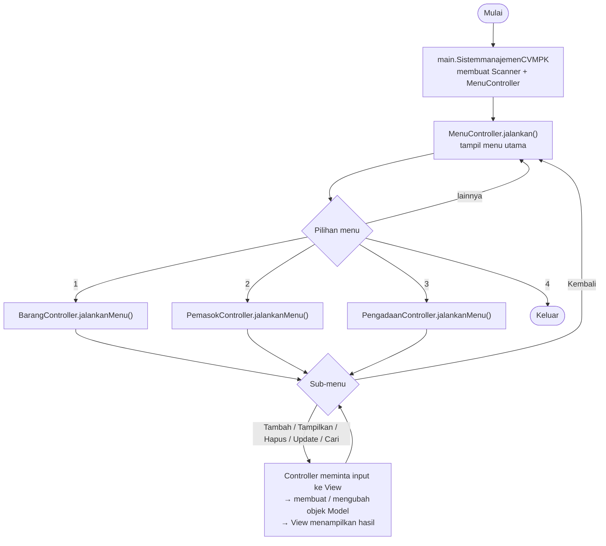

# LAPORAN MINI PROJECT 3 PEMROGRAMAN BERORIENTASI OBJEK

## SISTEM MANAJEMEN CV MANDIRI PRIMA KREATIF


---

Nama : **Elena Dementieva**

NIM : **2509116008**

Kelas : **Sistem Informasi A'25**

---

## **DAFTAR ISI**

- [BAB I Pendahuluan](#bab-i-pendahuluan)
- [BAB II Struktur Package](#bab-ii-struktur-package)
- [BAB III Alur Program](#bab-iii-alur-program)
- [BAB IV Validasi Input](#bab-iv-validasi-input)
- [BAB V Encapsulation dan Inheritance](#bab-v-encapsulation-dan-inheritance)
- [BAB VI Polymorphism dan Abstraction](#bab-vi-polymorphism-dan-abstraction)
- [BAB VII Nilai Tambah](#bab-vii-nilai-tambah)
- [BAB VIII Perbaikan dari Evaluasi Asisten Lab](#bab-viii-perbaikan-dari-evaluasi-asisten-lab)
- [BAB IX Kesimpulan](#bab-ix-kesimpulan)

---

## **BAB I PENDAHULUAN**

### **1.1 Deskripsi Singkat Program**

Sistem Manajemen CV Mandiri Prima Kreatif adalah program berbasis Java untuk membantu mengelola data pada CV Mandiri Prima Kreatif yang bergerak di bidang elektronik dan pengadaan barang.

Program mengelola tiga jenis data, yaitu data barang, data pemasok, dan data pengadaan, dengan konsep CRUD (Create, Read, Update, Delete). Khusus data barang, tersedia fitur tambahan Cari Barang (berdasarkan ID atau nama). Data disimpan sementara di dalam *"ArrayList"* selama program berjalan, dan sudah tersedia data awal (*dummy data*) pada tiap controller.

### **1.2 Tujuan**

Sistem Manajemen CV Mandiri Prima Kreatif dirancang dengan tujuan sebagai berikut:

* Membantu mengelola data barang, pemasok, dan pengadaan secara terstruktur.
* Memudahkan proses tambah, tampil, update, hapus, dan cari data (fungsi pencarian khusus pada data barang) terdapat dalam sistem.
* Menerapkan konsep pemrograman berorientasi objek, yaitu encapsulation, inheritance, polymorphism (overriding dan overloading), dan abstraction (abstract class dan abstract method) dalam program.
* Menerapkan struktur proyek MVC (Model, View, Controller) agar tugas dari setiap fungsi dalam bagian program terpisah dan kode lebih mudah dikelola.
* Menerapkan interface sebagai kontrak yang menyeragamkan seluruh controller data.
* Memastikan data yang dimasukkan sesuai melalui proses validasi input pada view dan model.

### **1.3 Alur Singkat**
Alur program dimulai dengan menampilkan menu utama Sistem Manajemen CV Mandiri Prima Kreatif, yaitu kelola data barang, kelola data pemasok, kelola data pengadaan, dan keluar. Menu utama diatur oleh MenuController, dimana menu tersebut meneruskan pilihan pengguna ke controller data yang sesuai. Menu utama akan terus ditampilkan sampai pengguna memilih menu keluar. Setiap menu kelola data memiliki sub-menu sendiri yang juga berulang sampai pengguna memilih kembali.

-> Pada menu kelola data barang, pengguna dapat memilih menu tambah, tampilkan, hapus, update stok, cari barang dan kembali. 

- Saat menambahkan barang, pengguna memasukkan ID barang, nama barang, dan stok, lalu memilih jenis barang, yaitu Barang Elektronik atau Barang Non-Elektronik.
- Barang elektronik memiliki data tambahan berupa garansi, sedangkan barang non-elektronik memiliki data tambahan berupa kategori.
- Lalu ID barang tidak boleh sama dengan ID yang sudah ada, dan pengguna dapat membatalkan penambahan dengan memasukkan angka 0 pada ID.
- Data barang yang ditampilkan dikelompokkan otomatis berdasarkan jenisnya.
- Pengguna juga dapat menghapus barang berdasarkan ID, memperbarui stok barang, serta mencari barang berdasarkan ID atau berdasarkan nama.

-> Pada menu kelola data pemasok, pengguna dapat menambahkan data pemasok dengan memasukkan ID pemasok, nama pemasok, alamat, dan nomor telepon yang hanya boleh berisi angka.
- Data pemasok yang telah tersimpan dapat ditampilkan, dihapus berdasarkan ID, serta diperbarui (nama, alamat, dan nomor telepon).

-> Pada menu kelola data pengadaan, pengguna dapat menambahkan data pengadaan dengan memasukkan ID pengadaan, tanggal pengadaan dengan format dd/MM/yyyy, dan alamat pengadaan.
- Data pengadaan yang telah tersimpan dapat ditampilkan, dihapus berdasarkan ID, serta diperbarui (tanggal dan alamat).

-> Setiap proses input dilengkapi dengan validasi pada dua lapis. 
- Lapis pertama ada di View, yang memastikan input tidak kosong, berupa angka jika yang diminta angka, dan memenuhi nilai minimal; input yang salah diminta ulang sampai benar.
- Lapis kedua ada di Model, yang menjaga aturan data seperti stok tidak boleh kurang dari 0, nomor telepon hanya angka, dan tanggal harus nyata.
Jika aturan pada program dilanggar oleh pengguna, maka model akan melempar IllegalArgumentException dan Controller menampilkan pesannya melalui view.

Dalam setiap proses, pembagian tugas mengikuti pola MVC, yaitu controller meminta input kepada view, membuat atau mengubah objek Model, menyimpannya ke dalam ArrayList, lalu meminta View menampilkan hasilnya kepada pengguna.

--------------

## **BAB II STRUKTUR PACKAGE**

Program menerapkan struktur **MVC (Model-View-Controller)** dengan satu package tambahan yaitu "main" sebagai jalan masuk ke dalam program.

```
sistemmanajemenCVMPK/
├── pom.xml
├── README.md
└── src/main/java/
    │
    ├── main/                              ← jalan masuk program
    │   └── SistemmanajemenCVMPK.java
    │
    ├── model/                             ← lapisan DATA & ATURAN DATA
    │   ├── Barang.java                    (abstract class)
    │   ├── BarangElektronik.java          (extends Barang)
    │   ├── BarangNonElektronik.java       (extends Barang)
    │   ├── Pemasok.java
    │   └── Pengadaan.java
    │
    ├── view/                              ← lapisan TAMPILAN (input & output)
    │   ├── BaseView.java                  (abstract class)
    │   ├── EntitasView.java               (abstract class, extends BaseView)
    │   ├── BarangView.java                (extends EntitasView)
    │   ├── PemasokView.java               (extends EntitasView)
    │   ├── PengadaanView.java             (extends EntitasView)
    │   └── MenuView.java                  (extends BaseView)
    │
    └── controller/                        ← lapisan PENGHUBUNG
        ├── Kelola.java                    (interface)
        ├── MenuController.java
        ├── BarangController.java          (implements Kelola)
        ├── PemasokController.java         (implements Kelola)
        └── PengadaanController.java       (implements Kelola)
```

### Penjelasan tiap package

| Package | Class | Tugas |
|---|---|---|
| `main` | `SistemmanajemenCVMPK` | Membuat `Scanner`, membuat `MenuController`, lalu menjalankannya. Tidak berisi logika lain. |
| `model` | `Barang`, `BarangElektronik`, `BarangNonElektronik`, `Pemasok`, `Pengadaan` | Menyimpan data dan menjaga aturan datanya (misalnya stok tidak boleh minus). Model **tidak** mencetak apa pun ke layar. Jika data tidak valid, model melempar `IllegalArgumentException`. |
| `view` | `BaseView`, `EntitasView`, `BarangView`, `PemasokView`, `PengadaanView`, `MenuView` | Seluruh `Scanner` dan `System.out` ada di sini: menampilkan menu, membaca input beserta validasinya, dan mencetak data. View tidak menyimpan data. |
| `controller` | `Kelola`, `MenuController`, `BarangController`, `PemasokController`, `PengadaanController` | Mengatur alur: meminta input ke View, membuat atau mengubah objek Model, menyimpannya di `ArrayList`, lalu meminta View menampilkan hasilnya. |

---

## **BAB III ALUR PROGRAM**

### **3.1 Diagram Alur**



### **3.2 Alur Pemanggilan MVC**

Contoh alur pada saat **Tambah Barang**:

1. `BarangController.tambah()` meminta input ID, nama, stok, dan jenis ke `BarangView`.
2. `BarangView` membaca input dan memvalidasinya (kosong, bukan angka, kurang dari minimal) sampai valid.
3. `BarangController` membuat objek `BarangElektronik` atau `BarangNonElektronik` (Model).
4. Model memeriksa aturan datanya. Jika dilanggar, Model melempar `IllegalArgumentException`.
5. `BarangController` menyimpan objek ke `ArrayList<Barang>`, lalu meminta `BarangView` menampilkan pesan hasil.

### **3.3 Menu Utama**

Saat program dijalankan, sistem akan menampilkan menu utama:

```
====================================================================
             SISTEM MANAJEMEN CV MANDIRI PRIMA KREATIF              
====================================================================
1. Kelola Data Barang
2. Kelola Data Pemasok
3. Kelola Data Pengadaan
4. Keluar
====================================================================
Pilih menu (1-4): 
```

### **3.4 Kelola Data Barang**

```
====================================================================
                         KELOLA DATA BARANG                         
====================================================================
1. Tambah Barang
2. Tampilkan Barang
3. Hapus Barang
4. Update Stok
5. Cari Barang
6. Kembali
====================================================================
Pilih menu: 
```

Data barang terbagi menjadi dua jenis:

- **Barang Elektronik**, memiliki atribut tambahan **garansi**.
- **Barang Non-Elektronik**, memiliki atribut tambahan **kategori**.

Saat fitur **Tampilkan Barang** dijalankan, data otomatis dikelompokkan berdasarkan jenisnya:

```
====================================================================
                           DAFTAR BARANG                            
====================================================================

|- BARANG ELEKTRONIK
--------------------------------------------------------------------
ID Barang   : 1
Nama        : Laptop ASUS
Stok        : 10
Garansi     : 2 Tahun


|- BARANG NON-ELEKTRONIK
--------------------------------------------------------------------
ID Barang   : 2
Nama        : Meja Kantor
Stok        : 5
Kategori    : Perlengkapan Kantor
--------------------------------------------------------------------
====================================================================
                      DATA SELESAI DITAMPILKAN                      
====================================================================
```

Fitur **Cari Barang** dapat dilakukan berdasarkan **ID Barang** atau **Nama Barang**, setelah pengguna selesai menginput data yang ingin dicari, maka program akan langsung menampilkan data nya:

```
====================================================================
                          CARI DATA BARANG                          
====================================================================
Cari berdasarkan:
1. ID Barang
2. Nama Barang
Cara pencarian (1-2): 2
Nama barang yang dicari: monitor
====================================================================
                          HASIL PENCARIAN                           
====================================================================

|- BARANG ELEKTRONIK
--------------------------------------------------------------------
ID Barang   : 3
Nama        : Monitor LG
Stok        : 8
Garansi     : 1 Tahun
--------------------------------------------------------------------
====================================================================
                      DATA SELESAI DITAMPILKAN                      
====================================================================
```

### **3.5 Kelola Data Pemasok**

Di dalam menu kelola data pemasok terdapat beberapa opsi yang diberikan, yaitu tambah, tampilkan, hapus, update, dan kembali. Data pemasok terdiri dari ID, nama, alamat, dan nomor telepon (hanya angka) jika pengguna menginput selain angka, maka program akan langsung menampilkan pesan bahwa data yang di input oleh pengguna tidak sesuai. Setelah itu. pengguna akan diminta untuk menginput ulang data nya.

```
====================================================================
                           TAMBAH DATA PEMASOK                          
====================================================================
--------------------------------------------------------------------
ID Pemasok (0 untuk kembali) : 3
Nama Pemasok : PT Huawei co.id
Alamat Pemasok  : China
No Telepon  : +86 138 0013 8000
--------------------------------------------------------------------
====================================================================
 >>>>>                 No Telepon harus berupa angka!          <<<<<            
====================================================================
```


```
====================================================================
                           DAFTAR PEMASOK                           
====================================================================
--------------------------------------------------------------------
ID Pemasok  : 1
Nama        : PT Sumber Elektronik
Alamat      : Samarinda
No Telepon  : 081234567890
--------------------------------------------------------------------
====================================================================
                      DATA SELESAI DITAMPILKAN                      
====================================================================
```

### **3.6 Kelola Data Pengadaan**

Di dalam menu kelola data pengadaan terdapat beberapa opsi yang diberikan, yaitu tambah, tampilkan, hapus, update, dan kembali. Data pengadaan terdiri dari ID, tanggal (format `dd/MM/yyyy`), dan alamat. jika pengguna menginput tanggal lalu formatnya tidak sesuai, maka program akan langsung menampilkan pesan bahwa data yang di input oleh pengguna tidak sesuai. Setelah itu, pengguna akan diminta untuk menginput ulang data nya.


```
====================================================================
                          DAFTAR PENGADAAN                          
====================================================================
--------------------------------------------------------------------
ID Pengadaan : 1
Tanggal      : 18/09/2026
Alamat       : Gudang CV MPK
--------------------------------------------------------------------
====================================================================
                      DATA SELESAI DITAMPILKAN                      
====================================================================
```

### **3.7 Keluar**

Jika pengguna memilih menu 4 pada menu utama, program menampilkan pesan terima kasih lalu berhenti.

```
====================================================================
>>>>>  Terima kasih telah menggunakan sistem manajemen CV MPK  <<<<<
====================================================================
```

---

## **BAB IV VALIDASI INPUT**

Validasi dilakukan pada **dua lapis**:

1. **View** (`BaseView`): memastikan input tidak kosong, berupa angka, dan memenuhi nilai minimal. Input diulang sampai valid.
2. **Model**: menjaga aturan data. Jika dilanggar, Model melempar `IllegalArgumentException` dan Controller menampilkan pesannya lewat View.

| Data | Aturan |
|---|---|
| ID (barang, pemasok, pengadaan) | wajib diisi, harus angka, tidak boleh duplikat, ID pada update/hapus minimal 1 |
| Nama, alamat, garansi, kategori | tidak boleh kosong |
| Stok | harus angka, tidak boleh kurang dari 0 |
| Jenis barang | hanya boleh 1 atau 2 |
| No telepon | tidak boleh kosong, hanya angka |
| Tanggal pengadaan | tidak boleh kosong, format `dd/MM/yyyy`, dan tanggalnya harus nyata (31/02/2026 ditolak) |
| Menu | harus angka dan sesuai pilihan yang tersedia |

Contoh hasil validasi saat **Tambah Barang** (input salah diulang sampai benar):

```
ID Barang (0 untuk kembali): abc
>>>>>              ID Barang harus berupa angka!               <<<<<
ID Barang (0 untuk kembali): -5
>>>>>           ID Barang tidak boleh kurang dari 0!           <<<<<
ID Barang (0 untuk kembali): 3
Nama Barang: 
>>>>>             Nama Barang tidak boleh kosong!              <<<<<
Nama Barang: Monitor LG
Stok Barang: x
>>>>>             Stok Barang harus berupa angka!              <<<<<
Stok Barang: -1
>>>>>          Stok Barang tidak boleh kurang dari 0!          <<<<<
Stok Barang: 8
Jenis Barang:
1. Barang Elektronik
2. Barang Non-Elektronik
Jenis barang (1-2): 9
>>>>>        Jenis barang hanya boleh memilih 1 atau 2!        <<<<<
Jenis barang (1-2): 1
Garansi: 
>>>>>               Garansi tidak boleh kosong!                <<<<<
Garansi: 1 Tahun
>>>>>            Barang baru berhasil ditambahkan!             <<<<<
```

(Setiap pesan pada contoh di atas tampil dalam kotak garis `====` pada program, diringkas di sini agar singkat.)

Validasi lain: input menu yang bukan angka ditolak dengan pesan `Input harus berupa angka!`, dan angka di luar pilihan ditolak dengan `Pilihan tidak valid!`.

---

## **BAB V ENCAPSULATION DAN INHERITANCE**

### **5.1 Encapsulation**

Semua atribut pada class Model dibuat `private` dan diakses melalui getter/setter. Setter juga berfungsi memvalidasi data sebelum disimpan.

Contoh pada `model/Barang.java`:

```java
public abstract class Barang {

    private final int idBarang;
    private String nama;
    private int stok;

    public int getIdBarang() { return idBarang; }
    public String getNama()  { return nama; }
    public int getStok()     { return stok; }

    public final void setStok(int stok) {
        if (stok < 0) {
            throw new IllegalArgumentException("Stok tidak boleh kurang dari 0!");
        }
        this.stok = stok;
    }
}
```

Poin penerapan encapsulation:

- Atribut `private`, sehingga tidak dapat diubah langsung dari class lain.
- ID dibuat `final` dan tidak punya setter, karena ID tidak boleh berubah setelah objek dibuat.
- Setter yang dibuka (`public`) hanya untuk data yang memang boleh diubah: `setStok` pada `Barang`, `setNama` / `setAlamat` / `setNoTelepon` pada `Pemasok`, dan `setTanggal` / `setAlamat` pada `Pengadaan`.
- Setter `setNama` (pada `Barang`), `setGaransi`, dan `setKategori` dibuat `private` karena hanya dipakai saat objek dibuat.
- Konsep yang sama diterapkan pada `Pemasok` dan `Pengadaan`.

### **5.2 Inheritance**

`Barang` adalah superclass, sedangkan `BarangElektronik` dan `BarangNonElektronik` adalah subclass.

```
              Barang (abstract)
                 |
        ┌────────┴────────┐
        ↓                 ↓
BarangElektronik    BarangNonElektronik
```

```java
public class BarangElektronik extends Barang {

    private String garansi;

    public BarangElektronik(int idBarang, String nama, int stok, String garansi) {
        super(idBarang, nama, stok);   // memanggil constructor superclass
        setGaransi(garansi);
    }
    ...
}
```

- Atribut umum (`idBarang`, `nama`, `stok`) ditulis **sekali** di `Barang`.
- Atribut khusus ada di subclass: `garansi` pada `BarangElektronik` dan `kategori` pada `BarangNonElektronik`.
- Subclass memakai `super(...)` untuk menjalankan constructor milik `Barang`.

Inheritance juga dipakai pada package view:

```
BaseView (abstract)
  ├── MenuView
  └── EntitasView<T> (abstract)
        ├── BarangView
        ├── PemasokView
        └── PengadaanView
```

---

## **BAB VI POLYMORPHISM DAN ABSTRACTION**

### **6.1 Abstraction**

#### Abstract class

| Abstract class | Lokasi | Fungsi |
|---|---|---|
| `Barang` | `model/Barang.java` | Kerangka umum barang. Tidak bisa dibuat langsung (`new Barang(...)` akan error), harus berupa barang elektronik atau non-elektronik. |
| `BaseView` | `view/BaseView.java` | Kerangka semua View: garis, judul, pesan, dan pembacaan input beserta validasinya. |
| `EntitasView<T>` | `view/EntitasView.java` | Kerangka View untuk satu jenis data: menu, input ID, dan daftar data. |

#### Abstract method

`model/Barang.java`:

```java
public abstract String getJenis();
public abstract String getLabelDetail();
public abstract String getNilaiDetail();
```

`view/EntitasView.java`:

```java
protected abstract String namaEntitas();
protected abstract void tampilDetail(T item);
```

Method tanpa isi tersebut **wajib** diisi oleh subclass. Contoh pada `BarangElektronik`:

```java
@Override
public String getJenis() { return "BARANG ELEKTRONIK"; }

@Override
public String getLabelDetail() { return "Garansi"; }

@Override
public String getNilaiDetail() { return getGaransi(); }
```

dan pada `BarangNonElektronik`:

```java
@Override
public String getJenis() { return "BARANG NON-ELEKTRONIK"; }

@Override
public String getLabelDetail() { return "Kategori"; }

@Override
public String getNilaiDetail() { return getKategori(); }
```

### **6.2 Polymorphism: Overriding**

| Lokasi | Method yang di-override | Keterangan |
|---|---|---|
| `BarangElektronik`, `BarangNonElektronik` | `getJenis()`, `getLabelDetail()`, `getNilaiDetail()` | Mengisi abstract method dari `Barang` |
| `BarangView`, `PemasokView`, `PengadaanView` | `namaEntitas()`, `tampilDetail()` | Mengisi abstract method dari `EntitasView` |
| `BarangView` | `labelUpdate()` | Mengubah teks menu menjadi "Update Stok" |
| `BarangView` | `daftarMenu()` | Menambah menu "Cari Barang" |
| `BarangView` | `tampilDaftar(List, String)` | Daftar barang dikelompokkan per jenis |
| `BarangController`, `PemasokController`, `PengadaanController` | `jalankanMenu()`, `tambah()`, `tampilkan()`, `hapus()`, `update()` | Mengisi kontrak interface `Kelola` |

**Dynamic polymorphism**: `ArrayList<Barang>` dapat menampung `BarangElektronik` maupun `BarangNonElektronik`. Saat ditampilkan, `BarangView` cukup memanggil method milik `Barang`, dan hasilnya otomatis menyesuaikan jenis objeknya:

```java
// BarangView.tampilDetail()
System.out.printf("%-12s: %s%n", barang.getLabelDetail(), barang.getNilaiDetail());
// objek BarangElektronik     → "Garansi     : 2 Tahun"
// objek BarangNonElektronik  → "Kategori    : Perlengkapan Kantor"
```

### **6.3 Polymorphism: Overloading**

| Lokasi | Method | Perbedaan parameter |
|---|---|---|
| `BarangController` | `cariBarang(int idBarang)` | Mencari berdasarkan ID, mengembalikan satu `Barang` |
| `BarangController` | `cariBarang(String keyword)` | Mencari berdasarkan nama, mengembalikan `List<Barang>` |
| `BaseView` | `bacaAngka(String label, int minimal)` | Membaca angka tanpa petunjuk |
| `BaseView` | `bacaAngka(String label, String petunjuk, int minimal)` | Membaca angka dengan petunjuk, misalnya "(0 untuk kembali)" |
| `BaseView` | `bacaTeks(String label)` | Membaca teks yang tidak boleh kosong |
| `BaseView` | `bacaTeks(String label, Predicate aturan, String pesan)` | Membaca teks dengan aturan tambahan (angka, tanggal) |
| `EntitasView` | `tampilDaftar(List data)` | Menampilkan daftar dengan judul bawaan |
| `EntitasView` | `tampilDaftar(List data, String judul)` | Menampilkan daftar dengan judul khusus ("HASIL PENCARIAN") |

Contoh pemakaian overloading `cariBarang` pada `BarangController`:

```java
Barang barang = cariBarang(view.inputId());           // parameter int
List<Barang> hasil = cariBarang(view.inputKeyword()); // parameter String
```

---

## **BAB VII NILAI TAMBAH**

Nilai tambah yang diterapkan pada proyek ini adalah **Interface**.

### **7.1 Letak Penerapan Interface**

| Berkas | Peran |
|---|---|
| `controller/Kelola.java` | **Interface** (kontrak) |
| `controller/BarangController.java` | `implements Kelola` |
| `controller/PemasokController.java` | `implements Kelola` |
| `controller/PengadaanController.java` | `implements Kelola` |
| `controller/MenuController.java` | Memakai tipe `Kelola` untuk memanggil ketiga controller |

### **7.2 Penjelasan**

Interface `Kelola` adalah kontrak yang wajib dipenuhi setiap controller data:

```java
public interface Kelola {

    void jalankanMenu();
    void tambah();
    void tampilkan();
    void hapus();
    void update();
}
```

Setiap controller menyetujui kontrak tersebut dengan `implements` dan wajib mengisi seluruh method-nya:

```java
public class BarangController implements Kelola { ... }
public class PemasokController implements Kelola { ... }
public class PengadaanController implements Kelola { ... }
```

`MenuController` hanya mengenal kontraknya (apa yang dikerjakan), bukan cara tiap controller mengerjakannya:

```java
private final Kelola kelolaBarang;
private final Kelola kelolaPemasok;
private final Kelola kelolaPengadaan;
...
case 1 -> kelolaBarang.jalankanMenu();
case 2 -> kelolaPemasok.jalankanMenu();
case 3 -> kelolaPengadaan.jalankanMenu();
```

Dengan cara ini seluruh controller memiliki nama method yang seragam, dan controller baru (misalnya untuk data pelanggan) dapat ditambahkan tanpa mengubah cara `MenuController` memanggilnya.

---

## **BAB VIII PERBAIKAN DARI EVALUASI ASISTEN LAB**

| Evaluasi | Perbaikan |
|---|---|
| Validasi input sudah bagus | Seluruh aturan validasi dipertahankan dan dipusatkan di `BaseView` serta class Model, sehingga tidak ditulis berulang. |
| `Service.java` sudah bagus tetapi terlalu panjang, sebaiknya dipisah sesuai konteks | `Service`, `ServiceBarang`, `ServicePemasok`, dan `ServicePengadaan` dipecah menjadi `MenuController`, `BarangController`, `PemasokController`, `PengadaanController` (alur) dan `MenuView`, `BarangView`, `PemasokView`, `PengadaanView` (input/output), ditambah `BaseView` dan `EntitasView` untuk kode bersama. Ukuran tiap controller kini sekitar 110 sampai 160 baris. |
| Dead code pada getter `getGaransi` dan `getKategori` | Kedua getter kini dipakai oleh `getNilaiDetail()` pada masing-masing subclass, lalu ditampilkan oleh `BarangView`. Setter dan getter lain yang tidak terpakai juga dihapus (misalnya `setIdBarang`). |

---

## **BAB IX KESIMPULAN**

Program Sistem Manajemen CV Mandiri Prima Kreatif adalah aplikasi Java yang mengelola data barang, pemasok, dan pengadaan. Pada Mini Project 3, program dikembangkan dengan:

- **Abstraction**: `Barang` sebagai abstract class dengan abstract method, serta `BaseView` dan `EntitasView` sebagai kerangka View.
- **Polymorphism**: overriding pada subclass `Barang`, View, dan controller; overloading pada pencarian barang, pembacaan input, dan penampilan daftar.
- **MVC**: pemisahan package `model`, `view`, dan `controller` dengan `main` sebagai titik masuk.
- **Interface** (nilai tambah): `Kelola` sebagai kontrak seluruh controller data.

Dengan penerapan tersebut, program menjadi lebih terstruktur, tidak ada kode yang berulang, dan lebih mudah dikembangkan.
