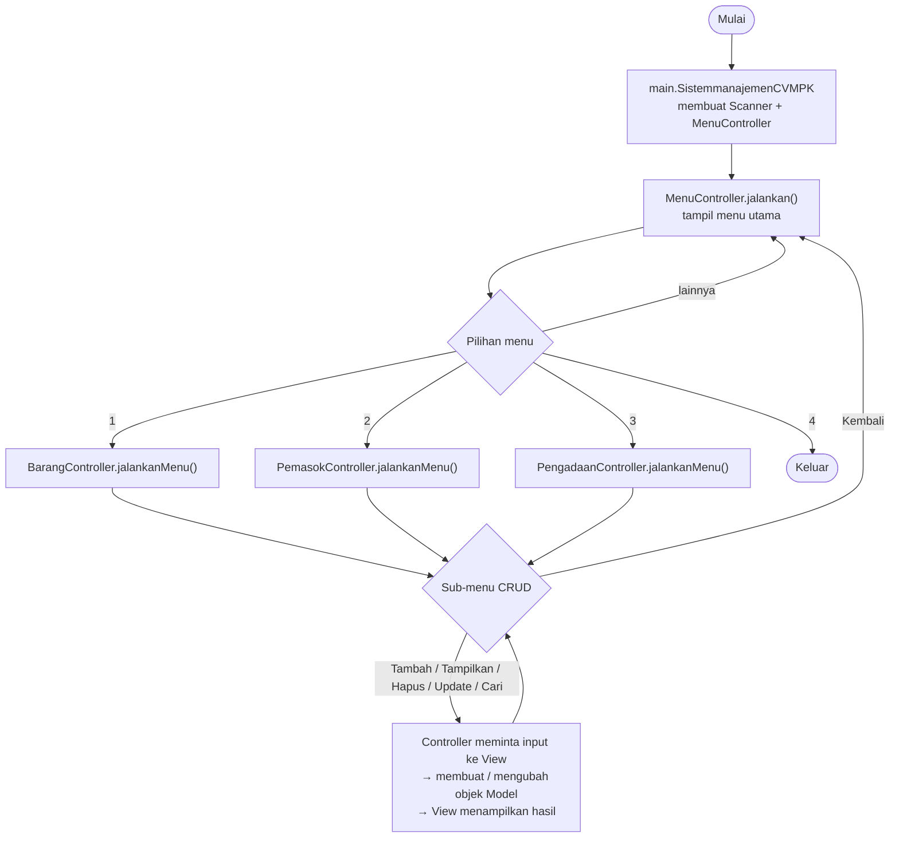

# LAPORAN MINI PROJECT 3 PEMROGRAMAN BERORIENTASI OBJEK

## SISTEM MANAJEMEN CV MANDIRI PRIMA KREATIF

---

Nama : **[ISI NAMA LENGKAP]**

NIM : **[ISI NIM]**

Kelas : **[ISI KELAS]**

---

## **BAB I PENDAHULUAN**

### **1.1 Deskripsi Singkat Program**

Sistem Manajemen CV Mandiri Prima Kreatif adalah program berbasis Java (aplikasi konsol) untuk membantu mengelola data pada CV Mandiri Prima Kreatif yang bergerak di bidang elektronik dan pengadaan barang.

Program mengelola tiga jenis data, yaitu **data barang**, **data pemasok**, dan **data pengadaan**, dengan konsep CRUD (Create, Read, Update, Delete). Khusus data barang, tersedia tambahan fitur **cari barang** (berdasarkan ID atau nama).

Mini Project 3 merupakan pengembangan dari Mini Project 2 dengan ketentuan:

- Menerapkan **polymorphism** (overriding dan overloading)
- Menerapkan **abstraction** (abstract class dan abstract method)
- Menerapkan struktur proyek **MVC** (Model, View, Controller)
- Nilai tambah: menerapkan **interface**

### **1.2 Cara Menjalankan**

1. Buka proyek melalui Apache NetBeans (proyek Maven).
2. Jalankan class `SistemmanajemenCVMPK` pada package `main`.

Atau lewat terminal (Maven):

```
mvn compile exec:java
```

---

## **BAB II STRUKTUR PACKAGE**

Program menerapkan struktur **MVC (Model-View-Controller)**.

```
sistemmanajemenCVMPK/
├── pom.xml
└── src/main/java/
    │
    ├── main/                              ← titik masuk aplikasi
    │   └── SistemmanajemenCVMPK.java
    │
    ├── model/                             ← lapisan DATA & ATURAN BISNIS
    │   ├── Barang.java                    (abstract class)
    │   ├── BarangElektronik.java          (extends Barang)
    │   ├── BarangNonElektronik.java       (extends Barang)
    │   ├── Pemasok.java
    │   └── Pengadaan.java
    │
    ├── view/                              ← lapisan TAMPILAN (input & output)
    │   ├── BaseView.java                  (abstract class)
    │   ├── EntitasView.java               (abstract class, extends BaseView)
    │   ├── BarangView.java                (extends EntitasView)
    │   ├── PemasokView.java               (extends EntitasView)
    │   ├── PengadaanView.java             (extends EntitasView)
    │   └── MenuView.java                  (extends BaseView)
    │
    └── controller/                        ← lapisan PENGHUBUNG
        ├── Kelola.java                    (interface)
        ├── MenuController.java
        ├── BarangController.java          (implements Kelola)
        ├── PemasokController.java         (implements Kelola)
        └── PengadaanController.java       (implements Kelola)
```

### Penjelasan tiap package

| Package | Class | Tugas |
|---|---|---|
| `main` | `SistemmanajemenCVMPK` | Membuat `Scanner`, membuat `MenuController`, lalu menjalankan program. Tidak berisi logika lain. |
| `model` | `Barang`, `BarangElektronik`, `BarangNonElektronik`, `Pemasok`, `Pengadaan` | Menyimpan data dan aturan data (misalnya stok tidak boleh minus). Model **tidak** mencetak apa pun ke layar. Jika data tidak valid, model melempar `IllegalArgumentException`. |
| `view` | `BaseView`, `EntitasView`, `BarangView`, `PemasokView`, `PengadaanView`, `MenuView` | Seluruh `Scanner` dan `System.out` ada di sini: menampilkan menu, membaca input beserta validasinya, dan mencetak data. View tidak menyimpan data. |
| `controller` | `Kelola`, `MenuController`, `BarangController`, `PemasokController`, `PengadaanController` | Mengatur alur: meminta input ke View, membuat/mengubah objek Model, menyimpannya di `ArrayList`, lalu meminta View menampilkan hasilnya. |

> Pada Mini Project 2, seluruh proses berada di class `Service`, `ServiceBarang`, `ServicePemasok`, dan `ServicePengadaan` yang sangat panjang karena input, validasi, dan proses data bercampur. Pada Mini Project 3 class tersebut dipecah menurut konteksnya (lihat **Bab VIII**).

---

## **BAB III ALUR PROGRAM**

### **3.1 Diagram Alur**



### **3.2 Alur Pemanggilan MVC**

Contoh alur pada saat **Tambah Barang**:

1. `BarangController.tambah()` meminta input ID, nama, stok, dan jenis ke `BarangView`.
2. `BarangView` membaca input dan memvalidasinya (kosong, bukan angka, kurang dari minimal) sampai valid.
3. `BarangController` membuat objek `BarangElektronik` atau `BarangNonElektronik` (Model).
4. Model memeriksa aturan datanya. Jika melanggar, Model melempar `IllegalArgumentException`.
5. `BarangController` menyimpan objek ke `ArrayList<Barang>`, lalu meminta `BarangView` menampilkan pesan hasil.

### **3.3 Menu Utama**

Saat program dijalankan, pengguna mendapat menu utama:

```
====================================================================
             SISTEM MANAJEMEN CV MANDIRI PRIMA KREATIF              
====================================================================
1. Kelola Data Barang
2. Kelola Data Pemasok
3. Kelola Data Pengadaan
4. Keluar
====================================================================
Pilih menu (1-4): 
```

### **3.4 Kelola Data Barang**

```
====================================================================
                         KELOLA DATA BARANG                         
====================================================================
1. Tambah Barang
2. Tampilkan Barang
3. Hapus Barang
4. Update Stok
5. Cari Barang
6. Kembali
====================================================================
Pilih menu: 
```

Data barang terbagi menjadi dua jenis:

- **Barang Elektronik**, memiliki atribut tambahan **garansi**.
- **Barang Non-Elektronik**, memiliki atribut tambahan **kategori**.

Saat fitur tampilkan dijalankan, data barang otomatis dikelompokkan berdasarkan jenisnya:

```
====================================================================
                           DAFTAR BARANG                            
====================================================================

|- BARANG ELEKTRONIK
--------------------------------------------------------------------
ID Barang   : 1
Nama        : Laptop ASUS
Stok        : 10
Garansi     : 2 Tahun

|- BARANG NON-ELEKTRONIK
--------------------------------------------------------------------
ID Barang   : 2
Nama        : Meja Kantor
Stok        : 5
Kategori    : Perlengkapan Kantor
--------------------------------------------------------------------
====================================================================
                      DATA SELESAI DITAMPILKAN                      
====================================================================
```

Fitur **Cari Barang** dapat dilakukan berdasarkan **ID Barang** atau **Nama Barang** (kata kunci, tidak membedakan huruf besar/kecil).

### **3.5 Kelola Data Pemasok**

Menu: Tambah, Tampilkan, Hapus, Update, Kembali. Data pemasok terdiri dari ID, nama, alamat, dan nomor telepon (hanya angka).

```
====================================================================
                           DAFTAR PEMASOK                           
====================================================================
--------------------------------------------------------------------
ID Pemasok  : 1
Nama        : PT Sumber Elektronik
Alamat      : Samarinda
No Telepon  : 081234567890
--------------------------------------------------------------------
====================================================================
                      DATA SELESAI DITAMPILKAN                      
====================================================================
```

### **3.6 Kelola Data Pengadaan**

Menu: Tambah, Tampilkan, Hapus, Update, Kembali. Data pengadaan terdiri dari ID, tanggal (format `dd/MM/yyyy`), dan alamat.

```
====================================================================
                          DAFTAR PENGADAAN                          
====================================================================
--------------------------------------------------------------------
ID Pengadaan: 1
Tanggal     : 18/09/2026
Alamat      : Gudang CV MPK
--------------------------------------------------------------------
====================================================================
                      DATA SELESAI DITAMPILKAN                      
====================================================================
```

### **3.7 Keluar**

Jika pengguna memilih menu 4, program menampilkan pesan terima kasih lalu berhenti.

```
====================================================================
>>>>>  Terima kasih telah menggunakan sistem manajemen CV MPK  <<<<<
====================================================================
```

---

## **BAB IV VALIDASI INPUT**

Validasi dilakukan pada **dua lapis**:

1. **View** (`BaseView`): memastikan input tidak kosong, berupa angka, dan memenuhi nilai minimal. Input diulang sampai valid.
2. **Model**: menjaga aturan data. Jika dilanggar, model melempar `IllegalArgumentException` dan Controller menampilkan pesannya lewat View.

| Data | Aturan |
|---|---|
| ID (barang, pemasok, pengadaan) | wajib diisi, harus angka, minimal 1, tidak boleh duplikat |
| Nama, alamat, garansi, kategori | tidak boleh kosong |
| Stok | harus angka, tidak boleh kurang dari 0 |
| Jenis barang | hanya boleh 1 atau 2 |
| No telepon | tidak boleh kosong, hanya angka |
| Tanggal pengadaan | tidak boleh kosong, format `dd/MM/yyyy` dan tanggal harus nyata (31/02/2026 ditolak) |
| Menu | harus angka dan sesuai pilihan yang tersedia |

---

## **BAB V ENCAPSULATION DAN INHERITANCE**

### **5.1 Encapsulation**

Semua atribut pada class Model dibuat `private`, dan diakses melalui getter/setter. Setter juga berfungsi memvalidasi data sebelum disimpan.

Contoh pada `model/Barang.java`:

```java
public abstract class Barang {

    private final int idBarang;
    private String nama;
    private int stok;

    public int getIdBarang() { return idBarang; }
    public String getNama()  { return nama; }
    public int getStok()     { return stok; }

    public final void setStok(int stok) {
        if (stok < 0) {
            throw new IllegalArgumentException("Stok tidak boleh kurang dari 0!");
        }
        this.stok = stok;
    }
}
```

Poin penerapan encapsulation:

- Atribut `private`, sehingga tidak bisa diubah langsung dari class lain.
- ID dibuat `final` dan tidak punya setter, karena ID tidak boleh berubah setelah objek dibuat.
- Setter hanya disediakan jika memang dipakai (misalnya `setStok` untuk menu Update Stok, `setNama` / `setAlamat` / `setNoTelepon` pada `Pemasok` untuk menu Update).
- Konsep yang sama diterapkan pada `Pemasok` dan `Pengadaan`.

### **5.2 Inheritance**

`Barang` adalah superclass, sedangkan `BarangElektronik` dan `BarangNonElektronik` adalah subclass.

```
              Barang (abstract)
                 |
        ┌────────┴────────┐
        ↓                 ↓
BarangElektronik    BarangNonElektronik
```

```java
public class BarangElektronik extends Barang {

    private String garansi;

    public BarangElektronik(int idBarang, String nama, int stok, String garansi) {
        super(idBarang, nama, stok);   // memanggil constructor superclass
        setGaransi(garansi);
    }
    ...
}
```

- Atribut umum (`idBarang`, `nama`, `stok`) ditulis **sekali** di `Barang`.
- Atribut khusus ditulis di subclass: `garansi` pada `BarangElektronik` dan `kategori` pada `BarangNonElektronik`.
- Subclass memakai `super(...)` untuk menjalankan constructor milik `Barang`.

Inheritance juga dipakai pada package view:

```
BaseView (abstract)
  ├── MenuView
  └── EntitasView<T> (abstract)
        ├── BarangView
        ├── PemasokView
        └── PengadaanView
```

---

## **BAB VI POLYMORPHISM DAN ABSTRACTION**

### **6.1 Abstraction**

#### Abstract class

| Abstract class | Lokasi | Fungsi |
|---|---|---|
| `Barang` | `model/Barang.java` | Kerangka umum barang. Tidak bisa dibuat langsung (`new Barang(...)` error), harus berupa elektronik atau non-elektronik. |
| `BaseView` | `view/BaseView.java` | Kerangka semua View: garis, judul, pesan, dan pembacaan input beserta validasinya. |
| `EntitasView<T>` | `view/EntitasView.java` | Kerangka View untuk satu jenis data: menu, input ID, dan daftar data. |

#### Abstract method

`model/Barang.java`:

```java
public abstract String getJenis();
public abstract String getLabelDetail();
public abstract String getNilaiDetail();
```

`view/EntitasView.java`:

```java
protected abstract String namaEntitas();
protected abstract void tampilDetail(T item);
```

Method tanpa isi tersebut **wajib** diisi oleh subclass. Contoh pada `BarangElektronik`:

```java
@Override
public String getJenis() { return "BARANG ELEKTRONIK"; }

@Override
public String getLabelDetail() { return "Garansi"; }

@Override
public String getNilaiDetail() { return getGaransi(); }
```

dan pada `BarangNonElektronik`:

```java
@Override
public String getJenis() { return "BARANG NON-ELEKTRONIK"; }

@Override
public String getLabelDetail() { return "Kategori"; }

@Override
public String getNilaiDetail() { return getKategori(); }
```

### **6.2 Polymorphism: Overriding**

| Lokasi | Method yang di-override | Keterangan |
|---|---|---|
| `BarangElektronik`, `BarangNonElektronik` | `getJenis()`, `getLabelDetail()`, `getNilaiDetail()` | Mengisi abstract method dari `Barang` |
| `BarangView`, `PemasokView`, `PengadaanView` | `namaEntitas()`, `tampilDetail()` | Mengisi abstract method dari `EntitasView` |
| `BarangView` | `labelUpdate()` | Mengubah teks menu menjadi "Update Stok" |
| `BarangView` | `daftarMenu()` | Menambah menu "Cari Barang" |
| `BarangView` | `tampilDaftar(List, String)` | Daftar barang dikelompokkan per jenis |
| Semua controller | `jalankanMenu()`, `tambah()`, `tampilkan()`, `hapus()`, `update()` | Mengisi kontrak interface `Kelola` |

**Dynamic polymorphism**: `ArrayList<Barang>` dapat menampung `BarangElektronik` maupun `BarangNonElektronik`. Saat ditampilkan, `BarangView` cukup memanggil method milik `Barang`, dan hasilnya otomatis menyesuaikan jenis objeknya:

```java
// BarangView.tampilDetail()
System.out.printf("%-12s: %s%n", barang.getLabelDetail(), barang.getNilaiDetail());
// elektronik     → "Garansi     : 2 Tahun"
// non-elektronik → "Kategori    : Perlengkapan Kantor"
```

### **6.3 Polymorphism: Overloading**

| Lokasi | Method | Perbedaan parameter |
|---|---|---|
| `BarangController` | `cariBarang(int idBarang)` | Mencari berdasarkan ID, mengembalikan satu `Barang` |
| `BarangController` | `cariBarang(String keyword)` | Mencari berdasarkan nama, mengembalikan `List<Barang>` |
| `BaseView` | `bacaAngka(String label, int minimal)` | Membaca angka tanpa petunjuk |
| `BaseView` | `bacaAngka(String label, String petunjuk, int minimal)` | Membaca angka dengan petunjuk, misalnya "(0 untuk kembali)" |
| `BaseView` | `bacaTeks(String label)` | Membaca teks yang tidak boleh kosong |
| `BaseView` | `bacaTeks(String label, Predicate aturan, String pesan)` | Membaca teks dengan aturan tambahan (angka, tanggal) |
| `EntitasView` | `tampilDaftar(List data)` | Menampilkan daftar dengan judul bawaan |
| `EntitasView` | `tampilDaftar(List data, String judul)` | Menampilkan daftar dengan judul khusus ("HASIL PENCARIAN") |

Contoh pemakaian overloading `cariBarang` pada `BarangController`:

```java
Barang barang = cariBarang(view.inputId());           // parameter int
List<Barang> hasil = cariBarang(view.inputKeyword()); // parameter String
```

---

## **BAB VII NILAI TAMBAH**

Nilai tambah yang diterapkan pada proyek ini adalah **Interface**.

### **7.1 Letak Penerapan Interface**

| Berkas | Peran |
|---|---|
| `controller/Kelola.java` | **Interface** (kontrak) |
| `controller/BarangController.java` | `implements Kelola` |
| `controller/PemasokController.java` | `implements Kelola` |
| `controller/PengadaanController.java` | `implements Kelola` |
| `controller/MenuController.java` | Memakai tipe `Kelola` untuk memanggil ketiga controller |

### **7.2 Penjelasan**

Interface `Kelola` adalah kontrak yang wajib dipenuhi setiap controller data:

```java
public interface Kelola {

    void jalankanMenu();
    void tambah();
    void tampilkan();
    void hapus();
    void update();
}
```

Setiap controller menyetujui kontrak tersebut dengan `implements` dan wajib mengisi seluruh method-nya:

```java
public class BarangController implements Kelola { ... }
public class PemasokController implements Kelola { ... }
public class PengadaanController implements Kelola { ... }
```

`MenuController` hanya mengenal kontraknya (apa yang dikerjakan), bukan cara tiap controller mengerjakannya:

```java
private final Kelola kelolaBarang;
private final Kelola kelolaPemasok;
private final Kelola kelolaPengadaan;
...
case 1 -> kelolaBarang.jalankanMenu();
case 2 -> kelolaPemasok.jalankanMenu();
case 3 -> kelolaPengadaan.jalankanMenu();
```

Dengan cara ini, seluruh controller memiliki nama method yang seragam, dan controller baru (misalnya untuk data pelanggan) dapat ditambahkan tanpa mengubah cara `MenuController` memanggilnya.

### **7.3 Nilai Tambah Lainnya**

- Struktur proyek **MVC** diterapkan penuh (Bab II), termasuk pemisahan tegas antara model, view, dan controller.
- Fitur **Cari Barang** (berdasarkan ID atau nama).

---

## **BAB VIII PERBAIKAN DARI EVALUASI ASISTEN LAB**

| Evaluasi | Perbaikan |
|---|---|
| Validasi input sudah bagus | Seluruh aturan validasi dipertahankan dan dipusatkan di `BaseView` agar tidak ditulis berulang. |
| `Service.java` sudah bagus tetapi terlalu panjang, sebaiknya dipisah sesuai konteks | `Service`, `ServiceBarang`, `ServicePemasok`, dan `ServicePengadaan` dipecah menjadi `MenuController`, `BarangController`, `PemasokController`, `PengadaanController` (alur) dan `MenuView`, `BarangView`, `PemasokView`, `PengadaanView` (input/output) beserta `BaseView` dan `EntitasView` untuk kode bersama. Controller menjadi sekitar 100 sampai 150 baris. |
| Dead code pada getter `getGaransi` dan `getKategori` | Kedua getter kini dipakai oleh `getNilaiDetail()` pada masing-masing subclass, lalu ditampilkan oleh `BarangView`. Setter dan getter lain yang tidak dipakai juga dihapus (misalnya `setIdBarang`). |

---

## **BAB IX KESIMPULAN**

Program Sistem Manajemen CV Mandiri Prima Kreatif adalah aplikasi Java yang mengelola data barang, pemasok, dan pengadaan. Pada Mini Project 3, program dikembangkan dengan:

- **Abstraction**: `Barang` sebagai abstract class dengan abstract method, serta `BaseView` dan `EntitasView` sebagai kerangka View.
- **Polymorphism**: overriding pada subclass `Barang`, View, dan controller; overloading pada pencarian barang, pembacaan input, dan penampilan daftar.
- **MVC**: pemisahan package `model`, `view`, dan `controller` dengan `main` sebagai titik masuk.
- **Interface** (nilai tambah): `Kelola` sebagai kontrak seluruh controller data.

Dengan penerapan tersebut, program menjadi lebih terstruktur, tidak ada kode yang berulang, dan lebih mudah dikembangkan.
